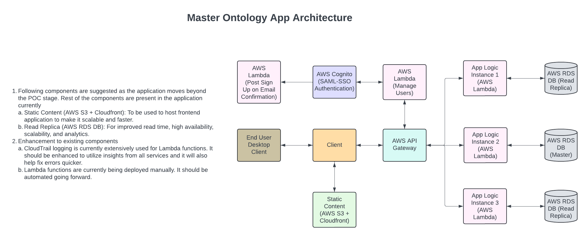

# Candidate name: Pooja Mule (poojamules95@gmail.com)

## TASK 1: Application for Master Ontology Concepts Maintenance
### Application URL
https://master.d2aukg2a51vgnk.amplifyapp.com

### Github Repository
https://github.com/PoojaVM/master-ontology-app

### Lambda functions:
1. Path
    - https://github.com/PoojaVM/master-ontology-app/tree/master/src/lambdas
2. Functions
    - `getConcepts`: Get all concepts from the database.
    - `addConcept`: Add a new concept to the database.
    - `updateConcept`: Update an existing concept in the database.
    - `deleteConcept`: Delete a concept from the database.
    - `listUsers`: Get all users from the database.
    - `updateUserPermission`: Update user role in the database.

### Usage Instructions:
1. The application can be accessed using [this link](https://master.d2aukg2a51vgnk.amplifyapp.com).
2. Permissions:
    - Application has 4 types of users: Super Admin, Admin, Editor, and Viewer.
    - Super Admin: Can add other users and assign roles. Can also add, edit and delete concepts. There is only one super admin.
    - Admin: Can add other users and assign only Editor and Viewer roles. Can also add, edit and delete concepts.
    - Editor: Can add, edit and delete concepts.
    - Viewer: Can only view the concepts. Can use filter functionality.
3. Login:
    - Use the following credentials to login:
        - Super Admin:
            - Username: ontologysuperuser
            - Password: Test@123
        - Admin: 
            - Username: poojavm1595
            - Password: Test@123
        - Editor:
            - Username: pmule
            - Password: Test@123
        - Viewer:
            - Username: poojamules95
            - Password: Test@123
4. Features:
    1. SAML Authentication
        - User can signup and signin using SAML authentication.
    2. Concepts
        - View, sort, and search concepts
        - Add, edit and delete concepts (Only for Super Admin, Admin, and Editor)
    3. Users (Only for Super Admin and Admin)
        - View users
        - Change user roles
            - Admin can only assign Editor and Viewer roles
            - Super Admin can assign Admin, Editor, and Viewer roles
    4. Validations and Error Handling:
        - Frontend:
            - Form validations are done as per the DB schema.
            - Error messages are displayed for invalid inputs.
            - Users are shown only the routes they have access to.
        - Backend:
            - Error messages are displayed for failed operations.
            - Permission based access is implemented.
    5. Notifications:
        - Notifications are displayed for successful and failed operations.
### Assumptions:
1. Concepts
    - Concepts can have multiple parents and children.
    - User can add any concept without any parent.
    - User can add multiple parents to a concept.
    - User can add multiple children to a concept.
2. Users
    - Super Admin can add users and assign roles to them.
    - Admin can add users and assign only Editor and Viewer roles.
    - Editor can add, edit and delete concepts.
    - Viewer can only view the concepts.

### UI Design:
1. The UI is avaiable in both light and dark mode.
2. Material-UI is used for designing the application.

### Database Schema

The database consists of two tables:
##### `ontology_clinical_concepts`

This table stores the main clinical concepts.

```sql
CREATE TABLE ontology_clinical_concepts (
    id BIGINT PRIMARY KEY AUTO_INCREMENT,
    display_name VARCHAR(255) NOT NULL,
    description TEXT,
    alternate_names VARCHAR(255)
);
```
##### `ontology_clinical_relationships`

This table stores the relationships between clinical concepts, defining parent-child hierarchies.

```sql
CREATE TABLE ontology_clinical_relationships (
    parent_id BIGINT,
    child_id BIGINT,
    PRIMARY KEY (parent_id, child_id),
    FOREIGN KEY (parent_id) REFERENCES ontology_clinical_concepts(id),
    FOREIGN KEY (child_id) REFERENCES ontology_clinical_concepts(id)
);
```
### Technology Stack:
- Frontend: ReactJS, Material-UI
- Backend: AWS Amplify, AWS RDS (Postgres), AWS Cognito, AWS Lambda, AWS API Gateway
- Deployment: AWS Amplify (Frontend), AWS Lambda (Backend)

### Primary Dependencies:
1. Material-UI: For designing the application.
2. AWS Amplify: For hosting the application and providing react sign-in and sign-up components.
3. Axios: For making API calls to the backend.
4. React Router: For routing in the application.

### Local Setup Instructions:
1. Clone the repository.
2. Run `npm install` to install the dependencies.
3. Run `npm start` to start the application.
4. Use same credentials as mentioned above to login.

## TASK 2: Questions for Ontology Team
1. How many concepts can a concept have as parents and children?
2. Is there parent-child relationship between concepts strictly enforced?
3. How often do the permissions change for the users?
4. What are good performance metrics for the application?
5. What are the most common operations performed on the concepts?
6. How many users are expected to use the application?
7. What additional features are expected in the application?
8. What is the user feedback on the current application?

### TASK 3: Target Application Architecture:
- This is the Master Ontolgy Application Architecture: 
- Links:
    - Image is stored in the GIT repo at [this](https://github.com/PoojaVM/master-ontology-app/blob/master/docs/architecture-diagram.png) location.
    - Diagram is drawn using LucidChart and can be viewed using this [link](https://lucid.app/lucidchart/430c5fc9-247f-4dc9-b240-0740f2c93f75/edit?viewport_loc=-479%2C24%2C2219%2C1095%2C0_0&invitationId=inv_8e39fa37-768e-4407-855e-7f6b36ecdb8a).
- Deployment Proposal:
    - The application can be deployed using AWS Amplify.
    - The frontend can be hosted on S3.
    - The backend can be hosted on AWS Lambda.
    - The database can be hosted on RDS.
    - The application can be accessed using the API Gateway.
    - Deployment can be automated using AWS CodePipeline.
- CSV Data Transformation Proposal:
    - The CSV data transformation can be done using AWS Glue.
    - The data can be transformed into a format that can be stored in the RDS database.
    - The transformed data can be stored in the RDS database using AWS Lambda functions.
    - The data can be accessed by the application using the API Gateway.
- Security Proposal:
    - User Authentication:
        - Use AWS Cognito for user authentication.
        - Use SAML for single sign-on.
    - Access Management:
        - Use AWS IAM for managing access to AWS resources.
        - Use AWS Cognito for managing user roles.
    - Data Encryption:
        - Use AWS KMS for encrypting the data.
        - Use SSL for encrypting the data in transit.
    - Network Security:
        - Use VPC for isolating the application.
        - Use Security Groups for controlling inbound and outbound traffic.
    - Compliance:
        - Ensure that the application is HIPAA compliant.
        - Ensure that the data is stored securely.
    - Web Application Firewall:
        - Use AWS WAF for protecting the application from common web exploits.
    - DDoS Protection:
        - Use AWS Shield for protecting the application from DDoS attacks ensuring high availability.


### Thank you for the opportunity!


